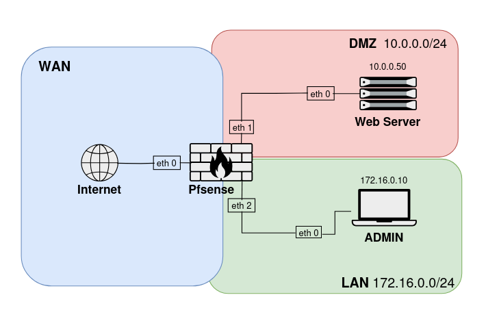
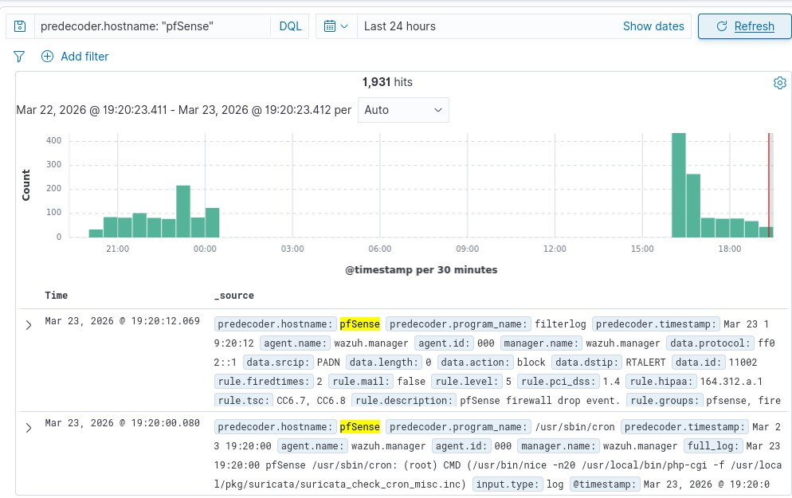
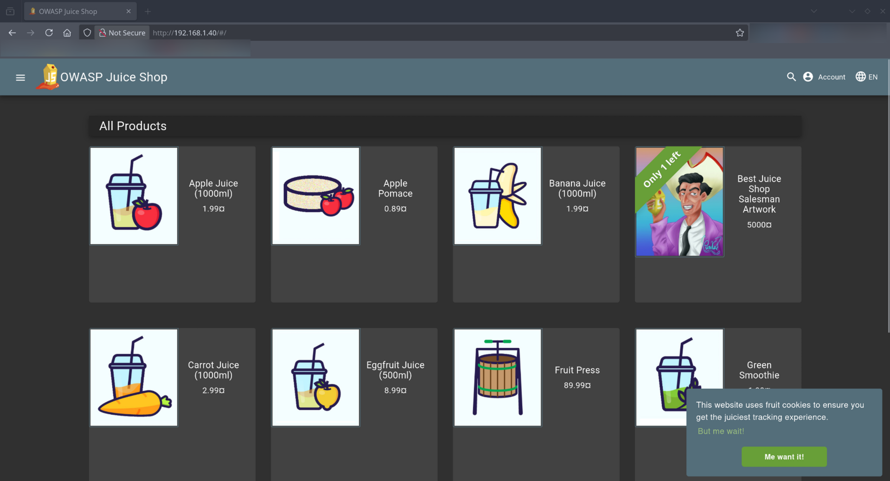

# Secure Gate — Laboratorio de Ciberseguridad

Laboratorio de infraestructura SOC virtualizado orientado a la práctica de segmentación de redes, defensa perimetral, detección de intrusiones y monitoreo de seguridad. El entorno simula una arquitectura empresarial realista protegida por un firewall pfSense, monitorizada por un stack SIEM Wazuh y equipada con una aplicación web intencionalmente vulnerable para ejercicios de seguridad ofensiva.

---

## Descripción general

|Propiedad|Valor|
|---|---|
|Hipervisor|VirtualBox|
|Firewall|pfSense 24.0|
|SIEM|Wazuh v4.14.3 (Docker)|
|IDS/IPS|Suricata 7.0.8 (en pfSense)|
|Aplicación objetivo|OWASP Juice Shop|
|SO del servidor DMZ|Debian 13 (Trixie)|
|SO del cliente admin|Debian (LAN)|

---

## Arquitectura de red

La infraestructura se divide en tres segmentos de red aislados administrados por pfSense:



### WAN — Interfaz externa

- **Interfaz:** `em0`
- **IP:** Dinámica (DHCP)
- **Rol:** Interfaz de cara a internet. Recibe tráfico externo y reenvía las peticiones TCP/3000 al servidor en la DMZ mediante una regla de port forwarding.

### DMZ — Zona Desmilitarizada (`10.0.0.0/24`)

- **Interfaz:** `em1`
- **Host:** `Webserver-Debian` — IP estática `10.0.0.50`
- **SO:** Debian 13 (Trixie) — Kernel 6.12.73+deb13-amd64
- **Rol:** Host Docker que ejecuta el stack SIEM Wazuh y la aplicación web vulnerable OWASP Juice Shop. El tráfico desde la DMZ hacia la LAN está bloqueado explícitamente a nivel de firewall para prevenir movimiento lateral.

### LAN — Red interna (`172.16.0.0/24`)

- **Interfaz:** `em2`
- **Host:** `Debian-Client` — IP estática `172.16.0.10`
- **Rol:** Estación de trabajo administrativa. Se utiliza para gestionar pfSense mediante su interfaz web y para conectarse por SSH al servidor en la DMZ.

---

## Stack de seguridad y monitoreo

### IDS/IPS perimetral — Suricata 7.0.8

Suricata corre directamente dentro de pfSense e inspecciona el tráfico en las tres interfaces de red: WAN, LAN y DMZ. Provee detección de intrusiones en tiempo real y genera alertas ante patrones de tráfico anómalos o maliciosos.

Conjuntos de reglas activos: Snort Community Rules, Emerging Threats Open y VRT Rules.

### SIEM — Wazuh v4.14.3

Wazuh está desplegado como un stack Docker Compose en el servidor de la DMZ. Centraliza la recolección de logs, la correlación de eventos y la generación de alertas para toda la infraestructura.

**Pipeline de logs:**

- pfSense reenvía logs de sistema, eventos de firewall y alertas de Suricata al servidor Debian vía syslog UDP en el puerto 514.
- rsyslog recibe los logs, los separa por origen y los escribe en archivos dedicados: `/var/log/pfsense.log` para los eventos del firewall y `/var/log/suricata-eve.log` para las alertas de Suricata en formato JSON. La separación es necesaria porque ambas fuentes llegan por el mismo canal UDP pero en formatos distintos.
- Ambos archivos son mapeados como volúmenes al contenedor del Wazuh manager para su procesamiento e indexación.



**Decisiones de configuración relevantes:**

- El puerto del dashboard de Wazuh fue cambiado de `443` a `8443` para evitar conflictos con Juice Shop, que corre en el mismo host.
- rsyslog aplica plantillas de formato diferenciadas para separar los logs de Suricata (JSON) de los del firewall (syslog string) antes de escribirlos a disco.
- Se habilitaron `logall` y `logall_json` en `wazuh_manager.conf` para garantizar la ingesta completa de los eventos de pfSense.
- El módulo de archivos de Filebeat fue activado (`archives: enabled: true`) para asegurar la indexación de todos los logs recibidos.
- logrotate controla el crecimiento en disco: `/var/log/pfsense.log` rota a los 50 MB y `/var/log/suricata-eve.log` a los 100 MB, conservando 2 archivos históricos comprimidos en cada caso.

### Aplicación web vulnerable — OWASP Juice Shop

Juice Shop está desplegado como contenedor Docker en el servidor de la DMZ y es accesible desde internet a través del port forwarding configurado en pfSense. Sirve como objetivo para ejercicios de seguridad ofensiva y para validar la detección de ataques web a través del SIEM.



---

## Reglas de firewall

|Dirección|Protocolo|Origen|Destino|Acción|
|---|---|---|---|---|
|WAN → DMZ|TCP|Cualquiera|10.0.0.50:3000|Permitir|
|WAN → *|Cualquiera|Cualquiera|Cualquiera|Denegar|
|LAN → DMZ|TCP|172.16.0.10|10.0.0.50:22|Permitir|
|LAN → DMZ|TCP|172.16.0.10|10.0.0.50:8443|Permitir|
|LAN → DMZ|ICMP|Red LAN|10.0.0.50|Permitir|
|LAN → DMZ|Cualquiera|Red LAN|Red DMZ|Denegar|
|LAN → *|Cualquiera|Red LAN|Cualquiera|Permitir|
|DMZ → LAN|Cualquiera|Red DMZ|Red LAN|Denegar|
|DMZ → *|Cualquiera|Red DMZ|Cualquiera|Permitir|

---

## Estructura del repositorio

```
secure-gate/
├── README.md
├── images/
│   ├── Infraestructura.png
│   ├── juice-shop-front.png
│   ├── syslog-ng-log-object.png
│   └── wazuh-pfsense-logs.png
├── pfsense-conf/
│   └── pfsense-secure-gateway.md      # Interfaces, reglas, NAT, DHCP, IDS, syslog, TLS y hardening
└── server-setup/
    ├── OS_Info.md                      # Información del sistema operativo del servidor DMZ
    ├── Docker_installation.md          # Instalación de Docker en Debian
    ├── Rsyslog_Installation.md         # Configuración de rsyslog y logrotate
    ├── Wazuh_Instalation_Details.md    # Despliegue y configuración del stack Wazuh
    └── Juice_Shop_Setup.md             # Despliegue de OWASP Juice Shop
```

---

## Objetivos de aprendizaje

- Diseñar e implementar una red segmentada con arquitectura de tres zonas (WAN / DMZ / LAN).
- Configurar y administrar un firewall stateful con política de denegación por defecto.
- Desplegar y operar una solución SIEM para centralización de logs y correlación de alertas.
- Integrar un IDS/IPS de nivel de red con telemetría SIEM.
- Gestionar el pipeline de logs desde el firewall hasta el SIEM, incluyendo normalización y separación por origen con rsyslog.
- Practicar escenarios de ataque sobre aplicaciones web en un entorno controlado e intencionalmente vulnerable.
- Analizar tráfico de ataque a través de los dashboards del firewall y del SIEM.

---

## Requisitos previos

- VirtualBox (u otro hipervisor) instalado en la máquina anfitriona.
- Conocimientos básicos de administración de sistemas Linux.
- Conocimientos básicos de redes (subnetting, enrutamiento, conceptos de firewall).
- Docker y Docker Compose instalados en el servidor de la DMZ.

---

## Licencia

Este proyecto tiene fines exclusivamente educativos y de investigación. Todos los componentes están desplegados en un entorno virtual aislado. El autor no asume ninguna responsabilidad por el uso indebido de las técnicas o configuraciones documentadas aquí.