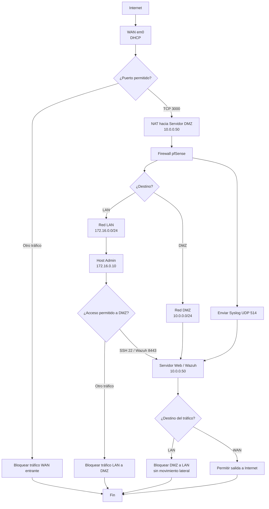

# pfSense Secure Gateway — Laboratorio de Seguridad de Red

**Plataforma:** pfSense 24.0  
**Hostname:** fw01-pfsense / fw01-pfsense.secure.gateway  

---

## Descripción general

Este proyecto documenta el diseño y la configuración de un gateway de red segmentado utilizando pfSense como appliance central de seguridad. La arquitectura impone aislamiento estricto entre tres zonas: una WAN de cara a internet, una LAN interna de administración y una DMZ que aloja los servicios expuestos. La configuración integra un motor IDS/IPS, registro centralizado y un proxy inverso con terminación TLS.

---

## Arquitectura de red

El firewall opera con tres interfaces lógicas, cada una asignada a una zona de seguridad diferente.

|Interfaz|Física|Dirección IP|Subred|Rol|
|---|---|---|---|---|
|WAN|em0|DHCP (dinámico)|/32|Enlace a internet|
|LAN|em2|172.16.0.1|/24|Red interna de administración|
|DMZ|em1|10.0.0.1|/24|Zona de servicios expuestos|

**Principio de diseño:** La LAN y la DMZ están completamente aisladas entre sí a nivel de firewall. Solo el tráfico explícitamente permitido puede cruzar los límites de zona. La WAN tiene el acceso entrante restringido únicamente al puerto 3000, redirigido al servidor web en la DMZ mediante NAT.

---

## Configuración DHCP

### LAN (172.16.0.0/24)

- Pool dinámico: `172.16.0.100` a `172.16.0.199`
- Clientes desconocidos: denegados (solo MACs registradas)
- ARP estático habilitado
- Reserva estática: `172.16.0.10` — Workstation Debian Admin (`08:00:27:07:95:db`)

### DMZ (10.0.0.0/24)

- Pool dinámico: `10.0.0.100` a `10.0.0.199`
- Clientes desconocidos: denegados
- ARP estático habilitado
- Servidores DNS: `1.1.1.1`, `1.0.0.1` (Cloudflare, aislados del DNS de la LAN)
- Reserva estática: `10.0.0.50` — Servidor Web Debian / Nodo Wazuh (`08:00:27:74:25:bd`)

---

## Reglas de firewall

Las reglas se evalúan de arriba hacia abajo por interfaz. La política sigue un esquema de denegación por defecto con reglas de permiso explícitas para los flujos de tráfico requeridos.

### Reglas WAN

|Acción|Origen|Destino|Protocolo|Descripción|
|---|---|---|---|---|
|PASS|any|10.0.0.50:3000|TCP|Tráfico entrante hacia servidor DMZ|
|BLOCK|any|any|any|Denegación por defecto de todo el tráfico WAN|

### Reglas LAN

|Acción|Origen|Destino|Protocolo|Descripción|
|---|---|---|---|---|
|PASS|172.16.0.10|10.0.0.50:8443|TCP|Acceso admin al Dashboard de Wazuh|
|PASS|172.16.0.10|10.0.0.50:22|TCP|Acceso SSH del admin al servidor DMZ|
|PASS|Red LAN|10.0.0.50|ICMP|Ping desde LAN hacia servidor DMZ|
|BLOCK|Red LAN|Red DMZ|any|Bloqueo de todo otro tráfico LAN a DMZ|
|PASS|Red LAN|any|any|Tráfico saliente por defecto (IPv4/IPv6)|

### Reglas DMZ

|Acción|Origen|Destino|Protocolo|Descripción|
|---|---|---|---|---|
|PASS|10.0.0.1|10.0.0.50:514|UDP|Reenvío de syslog de pfSense a Wazuh|
|BLOCK|Red DMZ|Red LAN|any|Bloqueo DMZ a LAN (previene pivoting)|
|PASS|Red DMZ|any|any|Tráfico saliente de DMZ hacia WAN|

---

## NAT

Una única regla de redirección de puertos reenvía el tráfico WAN entrante en el puerto 3000 al servidor web en la DMZ.

|Tipo|Interfaz|Protocolo|Puerto WAN|Destino|Descripción|
|---|---|---|---|---|---|
|Port Forward|WAN|TCP|3000|10.0.0.50|Redirección de tráfico WAN a DMZ|

La reflexión NAT está deshabilitada (`disablenatreflection: yes`) para evitar enrutamiento hairpin.

---

## DNS

- **Resolver:** Unbound (con soporte DNSSEC habilitado)
- **Servidores DNS del sistema:** `8.8.8.8`, `8.8.4.4` (Google)
- **Override local:** `securegate.com` resuelve a `127.16.0.1`
- Unbound está configurado para ocultar la identidad y la versión del servidor en consultas externas.

---

## Detección y prevención de intrusiones — Suricata

Suricata está desplegado como motor IDS/IPS en pfSense con inspección activa en las tres interfaces de red.

- **Versión:** 7.0.8_5
- **Interfaces monitorizadas:** WAN, LAN y DMZ
- **Conjuntos de reglas activos:**
    - Snort Community Rules: habilitado
    - Emerging Threats Open (ET Open): habilitado
    - VRT Rules: habilitado
    - ET Pro: deshabilitado
- **Actualización automática de reglas:** diaria
- **Modo de registro:** los logs de alertas se envían al sistema bajo la facilidad `local1` con prioridad `notice`

---

## Registro centralizado — Syslog

El sistema de registro está configurado para reenviar los logs del firewall al servidor de la DMZ mediante el protocolo syslog estándar en formato RFC 3164.

### Configuración de Syslog

|Parámetro|Valor|
|---|---|
|Servidor remoto|10.0.0.50:514|
|Protocolo|UDP|
|Formato|RFC 3164|
|Entradas por página|500|
|Compresión de logs|Ninguna|
|Registro de cambios|Habilitado|

El tráfico syslog desde pfSense (`10.0.0.1`) hacia el servidor Wazuh (`10.0.0.50:514`) está explícitamente permitido por una regla de firewall en la interfaz DMZ.

---

## Gestión de certificados TLS — ACME

Un certificado TLS wildcard es gestionado a través del paquete ACME:

|Nombre del certificado|Dominio|Método de validación|
|---|---|---|
|Wildcard_secure_gate|*.securegate.com|DNS (manual)|

El certificado se aplica tanto al proxy inverso HAProxy como a la interfaz WebGUI de pfSense.

---

## Interfaz de administración WebGUI

|Parámetro|Valor|
|---|---|
|Protocolo|HTTPS|
|Puerto|7443 (no estándar)|
|Certificado TLS|Certificado por defecto|
|Procesos máximos|2|
|Session roaming|Habilitado|

La interfaz de administración solo es accesible por HTTPS en un puerto no estándar, reduciendo la exposición a escaneos automatizados.

---

## Paquetes instalados

|Paquete|Propósito|
|---|---|
|Suricata|Detección y prevención de intrusiones en red (IDS/IPS)|
|HAProxy|Proxy inverso con terminación TLS|
|ACME|Gestión automatizada de certificados TLS (Let's Encrypt)|
|Shellcmd|Comandos de shell personalizados al inicio de pfSense|

---

## Consideraciones de hardening

- La interfaz WAN bloquea todas las direcciones bogon.
- La reflexión NAT está deshabilitada globalmente.
- Los servidores DHCP deniegan clientes desconocidos en LAN y DMZ, imponiendo registro por MAC.
- ARP estático habilitado en LAN y DMZ para prevenir ARP spoofing en hosts registrados.
- El acceso SSH remoto a pfSense no está habilitado en las reglas de firewall revisadas.
- Large Receive Offload (LRO) y TCP Segmentation Offload (TSO) están deshabilitados, configuración recomendada al ejecutar Suricata para garantizar inspección de paquetes completos.
- La WebGUI opera en el puerto 7443 en lugar del 443 por defecto.
- IPv6 está permitido a nivel de sistema, pero el RA de DHCPv6 está deshabilitado en la LAN.
- Suricata monitoriza activamente las tres interfaces (WAN, LAN y DMZ) para maximizar la cobertura de detección de amenazas.

---

## Resumen del flujo de tráfico

