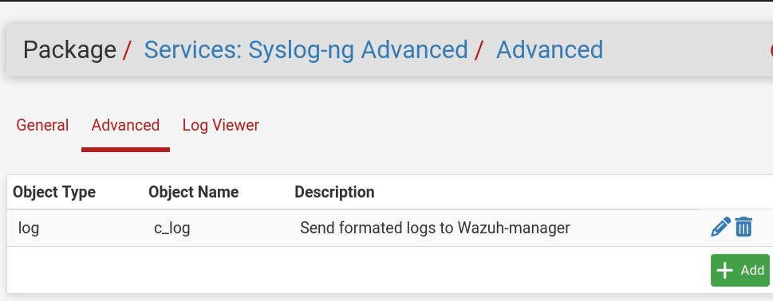

# pfSense Secure Gateway — Laboratorio de Seguridad de Red

**Plataforma:** pfSense 24.0  
**Hostname:** pfSense / secure.gateway  
**Zona horaria:** America/Argentina/Buenos_Aires  
**Fecha de exportación:** 2026-03-22

---

## Descripcion general

Este proyecto documenta el diseño y la configuración de un gateway de red segmentado utilizando pfSense como appliance central de seguridad. La arquitectura impone aislamiento estricto entre tres zonas: una WAN de cara a internet, una LAN interna de administration y una DMZ que aloja los servicios expuestos. La configuración integra un motor IDS/IPS, registro centralizado y un proxy inverso con terminación TLS.

---

## Arquitectura de red

El firewall opera con tres interfaces lógicas, cada una asignada a una zona de seguridad diferente.

| Interfaz | Fisica | Direccion IP    | Subred | Rol                           |
|----------|--------|-----------------|--------|-------------------------------|
| WAN      | em0    | DHCP (dinamico) | /32    | Enlace a internet             |
| LAN      | em2    | 172.16.0.1      | /24    | Red interna de administracion |
| DMZ      | em1    | 10.0.0.1        | /24    | Zona de servicios expuestos   |

**Principio de diseno:** La LAN y la DMZ estan completamente aisladas entre si a nivel de firewall. Solo el trafico explicitamente permitido puede cruzar los limites de zona. La WAN tiene el acceso entrante restringido unicamente a los puertos HTTP/HTTPS, redirigidos al servidor web en la DMZ.

---

## Configuracion DHCP

### LAN (172.16.0.0/24)

- Pool dinamico: `172.16.0.100` a `172.16.0.199`
- Clientes desconocidos: denegados (solo MACs registradas)
- ARP estatico habilitado
- Reserva estática: `172.16.0.10` — Workstation Debian Admin (`08:00:27:07:95:db`)

### DMZ (10.0.0.0/24)

- Pool dinámico: `10.0.0.100` a `10.0.0.199`
- Clientes desconocidos: denegados
- ARP estatico habilitado
- Servidores DNS: `1.1.1.1`, `1.0.0.1` (Cloudflare, aislados del DNS de la LAN)
- Reserva estatica: `10.0.0.50` — Servidor Web Debian / Nodo Wazuh (`08:00:27:74:25:bd`)

---

## Reglas de firewall

Las reglas se evaluan de arriba hacia abajo por interfaz. La politica sigue un esquema de denegacion por defecto con reglas de permiso explicitas para los flujos de trafico requeridos.

### Reglas WAN

| Accion | Origen | Destino          | Protocolo | Descripcion                                   |
|--------|--------|------------------|-----------|-----------------------------------------------|
| PASS   | any    | 10.0.0.50:80,443 | TCP       | HTTP/HTTPS entrante hacia servidor DMZ        |
| BLOCK  | any    | any              | any       | Denegacion por defecto de todo el trafico WAN |

### Reglas LAN

| Accion | Origen      | Destino          | Protocolo | Descripcion                              |
|--------|-------------|------------------|-----------|------------------------------------------|
| PASS   | 172.16.0.10 | 10.0.0.50:8443   | TCP       | Acceso admin al Dashboard de Wazuh       |
| PASS   | 172.16.0.10 | 10.0.0.50:22     | TCP       | Acceso SSH del admin al servidor DMZ     |
| PASS   | Red LAN     | 10.0.0.50:80,443 | TCP       | Trafico web de LAN hacia DMZ             |
| PASS   | Red LAN     | 10.0.0.50        | ICMP      | Ping desde LAN hacia servidor DMZ        |
| BLOCK  | Red LAN     | Red DMZ          | any       | Bloqueo de todo otro trafico LAN a DMZ   |
| PASS   | Red LAN     | any              | any       | Trafico saliente por defecto (IPv4/IPv6) |

### Reglas DMZ

| Accion | Origen   | Destino        | Protocolo | Descripcion                            |
|--------|----------|----------------|-----------|----------------------------------------|
| PASS   | 10.0.0.1 | 10.0.0.50:5140 | UDP       | Reenvio de syslog de pfSense a Wazuh   |
| BLOCK  | Red DMZ  | Red LAN        | any       | Bloqueo DMZ a LAN (previene pivoting)  |
| PASS   | Red DMZ  | any            | any       | Trafico saliente de DMZ hacia WAN      |

---

## NAT

Una unica regla de redireccion de puertos reenvía el trafico WAN entrante en los puertos 80 y 443 al servidor web en la DMZ.

| Tipo         | Interfaz | Protocolo | Puerto WAN | Destino   | Descripcion                      |
|--------------|----------|-----------|------------|-----------|----------------------------------|
| Port Forward | WAN      | TCP       | 80, 443    | 10.0.0.50 | Redireccion HTTP/HTTPS WAN a DMZ |

La reflexion NAT esta deshabilitada (`disablenatreflection: yes`) para evitar enrutamiento hairpin.

---

## DNS

- **Resolver:** Unbound (con soporte DNSSEC habilitado)
- **Servidores DNS del sistema:** `8.8.8.8`, `8.8.4.4` (Google)
- **Override local:** `securegate.com` resuelve a `127.16.0.1`
- Unbound esta configurado para ocultar la identidad y la version del servidor en consultas externas.

---

## Deteccion y prevencion de intrusiones — Suricata

Suricata esta desplegado como motor IDS/IPS en pfSense.

- **Version:** 7.0.8_5
- **Conjuntos de reglas activos:**
  - Snort Community Rules: habilitado
  - Emerging Threats Open (ET Open): habilitado
  - VRT Rules: deshabilitado
  - ET Pro: deshabilitado
- **Actualizacion automatica de reglas:** diaria a las 00:11
- **Modo de bloqueo:** los hosts bloqueados se liberan al reiniciar el demonio
- **Registro:** enviado al log del sistema bajo la facilidad `security` con prioridad `notice`

---

## Registro centralizado — Syslog-ng

Syslog-ng reemplaza al demonio syslog por defecto de pfSense mediante un comando de shell ejecutado al inicio:

```bash
service syslogd stop && service syslog-ng start
```

### Configuracion de Syslog-ng

| Parametro             | Valor                       |
|-----------------------|-----------------------------|
| Interfaz de escucha   | lo0                         |
| Protocolo por defecto | UDP                         |
| Puerto por defecto    | 5141                        |
| Directorio de logs    | /var/log/syslog-ng          |
| Frecuencia de archivo | Diaria                      |
| Compresion            | gzip (.gz)                  |
| Maximo de archivos    | 30 dias                     |
| Certificado TLS       | Certificado por defecto GUI |

El syslog del sistema de pfSense esta configurado para reenviar logs a `127.0.0.1:5141`, donde syslog-ng los recibe y redistribuye. La regla de firewall en la DMZ permite explicitamente el trafico UDP desde `10.0.0.1` hacia `10.0.0.50:5140`, habilitando el reenvio de logs hacia una instancia de Wazuh SIEM desplegada en la DMZ.

---

## Proxy inverso — HAProxy

HAProxy esta instalado y configurado como proxy inverso con terminacion TLS.

- **Conexiones maximas:** 100
- **Facilidad de log:** local0
- **Certificado TLS:** Wildcard `*.securegate.com` (gestionado via ACME / Let's Encrypt, validacion DNS manual)
- HAProxy se reinicia automaticamente ante cambios de configuracion mediante un comando de shell registrado.

---

## Gestion de certificados TLS — ACME

Un certificado TLS wildcard es gestionado a traves del paquete ACME:

| Nombre del certificado | Dominio          | Metodo de validacion |
|------------------------|------------------|----------------------|
| Wildcard_secure_gate   | *.securegate.com | DNS (manual)         |

El certificado se aplica tanto al proxy inverso HAProxy como a la interfaz WebGUI de pfSense.

---

## Interfaz de administracion WebGUI

| Parametro        | Valor                   |
|------------------|-------------------------|
| Protocolo        | HTTPS                   |
| Puerto           | 10443 (no estandar)     |
| Certificado TLS  | Certificado por defecto |
| Procesos maximos | 2                       |
| Session roaming  | Habilitado              |

La interfaz de administracion solo es accesible por HTTPS en un puerto no estandar, reduciendo la exposicion a escaneos automatizados.

---

## Paquetes instalados

| Paquete   | Proposito                                                |
|-----------|----------------------------------------------------------|
| Suricata  | Deteccion y prevencion de intrusiones en red (IDS/IPS)   |
| HAProxy   | Proxy inverso con terminacion TLS                        |
| ACME      | Gestion automatizada de certificados TLS (Let's Encrypt) |
| Syslog-ng | Recoleccion y reenvio avanzado de logs                   |
| Shellcmd  | Comandos de shell personalizados al inicio de pfSense    |

Usé Syslog-ng para enviar los logs a Wazuh y ademas debí implementar un template customizado para que los logs pudieran ser normalizados por los decoders de Wazuh ya que si uso el syslogd, el servicio por defecto de pfSense, los logs no llegan en un formato compatible.

el contenido de c_log es: `log {source {system(); internal(); }; destination {network("10.0.0.50" port(5140) transport("udp") template("$DATE $HOST $PROGRAM: $MSG\n")); file("/var/log/pfsense.secure.gateway.log"); };};`

Lo que hace c_log es indicar que debe tomar los logs del sistema en /var/run/log , ademas de los internos de syslog-ng y enviarlos al endpoint 10.0.0.50 que es el server en DMZ a travez del puerto 5140 usando el protocolo UDP formateado tal como "Date HOST PROGRAM: MSG" porque es el formato de los decoders de Wazuh y ademas los guarda en el archivo /var/log/pfsense.secure.gateway.log para tener un respaldo de los logs en el propio pfSense.




---

## Consideraciones de hardening

- La interfaz WAN bloquea todas las direcciones bogon.
- La reflexion NAT esta deshabilitada globalmente.
- Los servidores DHCP deniegan clientes desconocidos en LAN y DMZ, imponiendo registro por MAC.
- ARP estatico habilitado en LAN y DMZ para prevenir ARP spoofing en hosts registrados.
- El acceso SSH remoto a pfSense no esta habilitado en las reglas de firewall revisadas.
- Large Receive Offload (LRO) y TCP Segmentation Offload (TSO) estan deshabilitados, configuracion recomendada al ejecutar Suricata para garantizar inspeccion de paquetes completos.
- La WebGUI opera en el puerto 10443 en lugar del 443 por defecto.
- IPv6 esta permitido a nivel de sistema, pero el RA de DHCPv6 esta deshabilitado en la LAN.

---

## Resumen del flujo de trafico

flowchart TD

```mermaid
flowchart TD
  A[Internet] --> B[WAN (em0) DHCP]

  B --> C{¿Puerto permitido?}
  C -- TCP 3000 --> D[NAT hacia Servidor DMZ 10.0.0.50]
  C -- Otro tráfico --> E[Bloquear tráfico WAN entrante] --> Z[Fin]

  D --> F[Firewall pfSense]

  F --> G{¿Destino?}

  %% --- LAN ---
  G -- LAN --> H[Red LAN 172.16.0.0/24]
  H --> I[Host Admin 172.16.0.10]

  I --> J{¿Acceso permitido a DMZ?}
  J -- SSH 22 / Wazuh 8443 / HTTP-HTTPS --> K[Servidor DMZ 10.0.0.50]
  J -- Otro tráfico --> L[Bloquear tráfico LAN → DMZ] --> Z

  %% --- DMZ ---
  G -- DMZ --> M[Red DMZ 10.0.0.0/24]
  M --> K

  K --> N{¿Destino del tráfico?}
  N -- LAN --> O[Bloquear DMZ → LAN (sin movimiento lateral)] --> Z
  N -- WAN --> P[Permitir salida a Internet]

  %% --- SYSLOG ---
  F --> Q[Enviar Syslog UDP 5140]
  Q --> K

  P --> Z[Fin]
```

---

*Configuracion exportada desde pfSense 24.0 el 2026-03-22. Los valores sensibles (hashes de contrasenas, claves privadas de certificados y datos cifrados) estan presentes en el archivo de backup original y no se reproducen en este documento.*
