# Telegram Notifications

En una infraestructura de seguridad que esta 24/7 funcionando es necesario implementar un sistema de alerta temprana para tratar de disminuir el MTTR. Para evitar el ruido se limito a solo permitir notificaciones de alertas criticas de nivel 8.

Debido a que es un laboratorio de pruebas abordé esta implementación con un enfoque pragmático y decidí usar telegram ya que es simple de implementar y portable, lo cual me permite atender las notificaciones en tiempo real desde mi celular.

Debido a que tengo implementado Wazuh en un docker, esto le agrega una capa de complejidad en la configuración porque tengo que hacer los cambios en el host y mapearlo al directorio interno del contenedor.

Como pre-condición para la implementación de esta funcionalidad hay que tener creado un bot en Telegram usando el @BotFather, hay que guardar el Token y el ID del chat.

Como guía use la documentación y el script proporcionados por [Clockwork Computer](https://clockworkcomputerip.blogspot.com/2025/12/wazuh-telegram.html).

---
### Instalación:

Lo primero fue clonar el repositorio de que contiene los scripts en /tmp y pasarlos al directorio donde están guardados los archivos de configuración de Wazuh manager. esto lo hice desde el endpoint Debian pensado para la administración del server. si bien no esta en la imagen es importante darle los permisos necesarios al script para que wazuh lo pueda ejecutar correctamente.

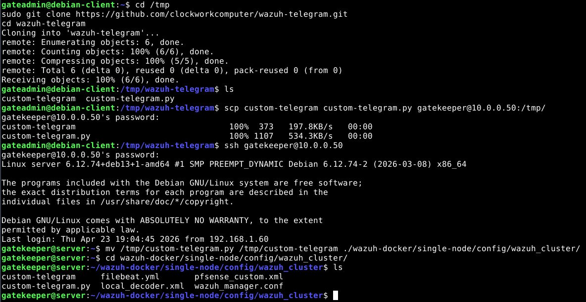

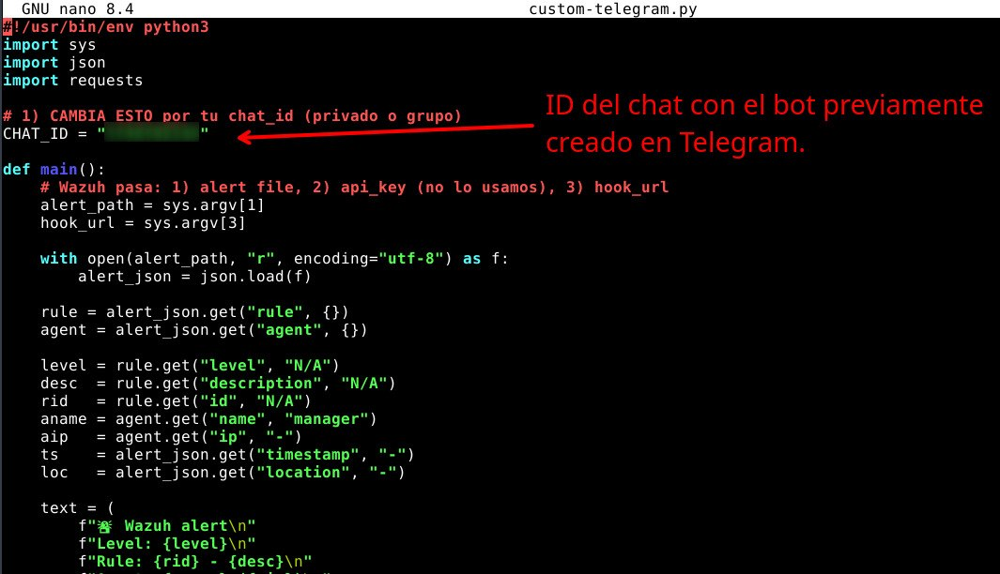

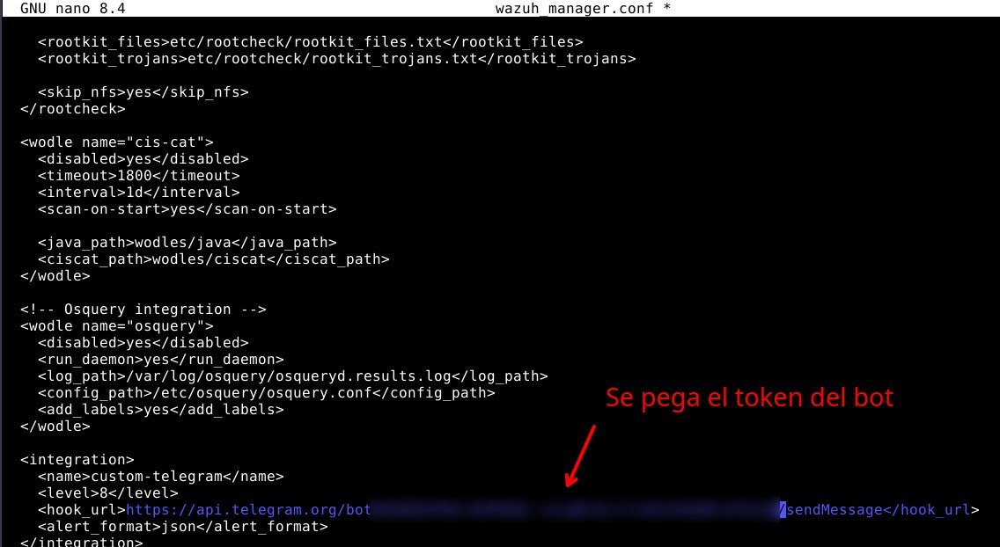

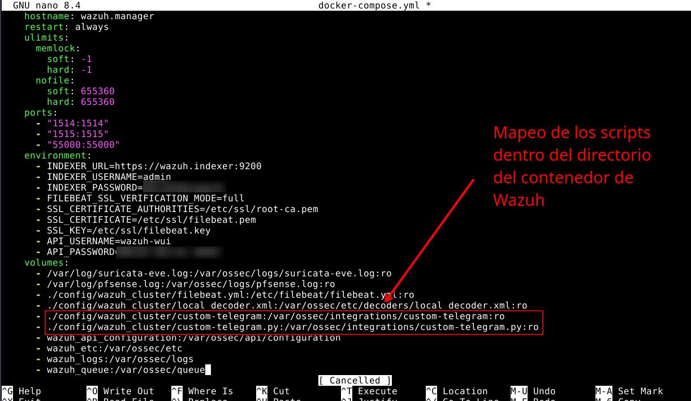

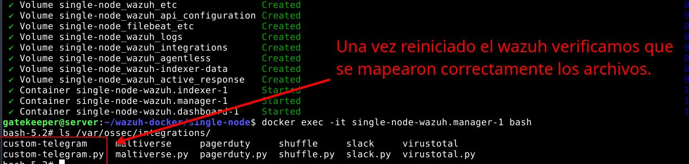

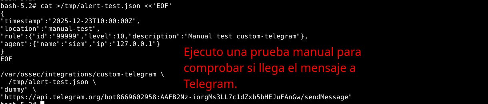

Y efectivamente llego el mensaje

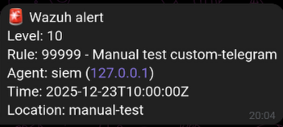

---

### Prueba Real

Para esta prueba voy a generar un alerta de nivel 8 creando un usuario nuevo en el server que hace de host para el contenedor de wazuh, el cual tiene un wazuh-agent para monitorearlo.

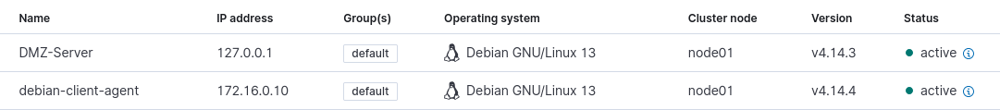

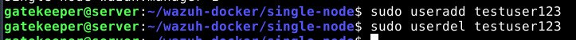

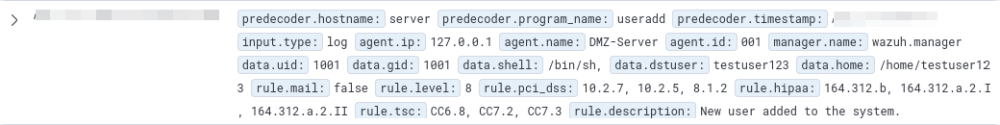
 
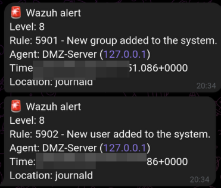

**Wazuh envió el mensaje a Telegram correctamente**

Como dato adicional se puede ver como Suricata detecto y alerto que se estaba conectando a Telegram lo cual puede ser potencialmente perjudicial pero yo se que es trafico legitimo es por eso que decidí por el momento no tomar acción a pesar el ruido que puede generar.

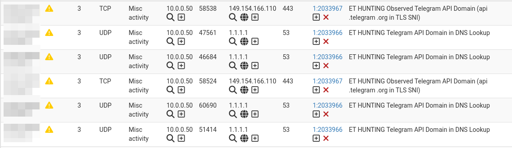